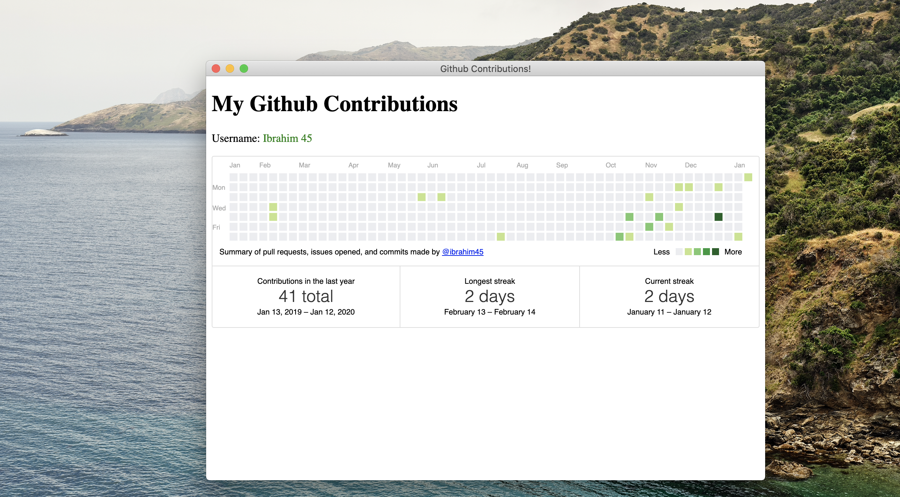

# Github Personal Contribution 

    View your github contributions level, without login into github.com site.


**prerequisites**

 - Install Node & NPM (preffered: Stable Version)
 - Mac OS


Do the following, to run it on your machine, (Only once)


1. ``` git clone https://github.com/ibrahim45/github-contributions-desktop-app.git ```

2. ```npm i ```

3. Update your github username in ```app/js/github.js```

    ```
    GitHubCalendar(".calendar", "your-username", { responsive: true });

    ```

3. npm run dist // To generate .dmg applications.


# Final Output

<div align="center">
     
</div>


# Setup App Icon

Reference:

 [1] - https://github.com/onmyway133/blog/issues/66

 [2] - https://medium.com/fantageek/changing-electron-app-icon-acf26906c5ad
 


